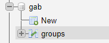

# Gab Group Crawler

> A Crawler designed to document and index groups from gab.com.

> Repo contains 2 projects: 

> The 1st one is a simple Python demo using Selenium to grab the data and then saving it in .CSV format.

> The 2nd uses Puppeteer in Node.js to run a headless browser and save data to SQL. Includes a simple React.JS front-end and a Node.JS express server to fetch data from SQL.

- Both Crawler scripts need to be run independently.


## Crawler.py

- Enter your details in config.ini.un for validation.
- Index in config is set to 1 so it starts from the 1st group.
- Run py crawler.py.
- Details will then be saved in groups.csv.

## Crawler.js

- DB Configuration described here : </br>
</br>
[](https://imgur.com/C7tYpAk)


- Enter your details in crawler.js to userAuth
```javascript

const userAuth = {
	email: '', // Insert your gab account details here for authentication
	password: ''
};
```

- and in DatabaseHandler.js.

```javascript

	config = {
		host: 'localhost',
		user: 'root',
		password: '',
		database: 'gab'
	};
```


- Run crawler.js.
- Details will be saved in DB.

---

- Run server/gabGrabServer.js to enable the group fetching.
- Navigate to Front/gab-groups and use npm start to run the react front.

[(https://imgur.com/VCiTSp2)]()
